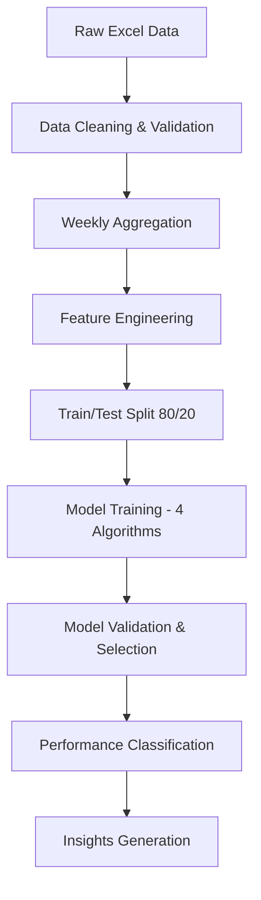

# 🏥 RMT Healthcare Revenue Performance Analysis

[](https://gkotzbauer.github.io/RMT-Revenue-Performance-Analysis/)
[](https://opensource.org/licenses/MIT)
[](https://github.com/gkotzbauer/RMT-Revenue-Performance-Analysis/actions)

**Professional Healthcare Revenue Performance Analysis Tool with Advanced Statistical Methodology**

A comprehensive web-based analytics platform that provides sophisticated statistical analysis of healthcare revenue data, featuring predictive modeling, performance classification, and actionable business insights.

## 🌟 Live Demo

**🚀 [Try the Live Application](https://gkotzbauer.github.io/RMT-Revenue-Performance-Analysis/)**

Upload your Excel data and get instant statistical analysis with professional visualizations.

---

## ✨ Key Features

### 🔬 **Advanced Statistical Methodology**
- **Proper Train/Test Split** (80/20 chronological) prevents overfitting
- **Multiple Model Comparison** with rigorous validation
- **Statistical Metrics**: MAE, RMSE, MAPE, R-squared
- **No Data Leakage** - correlations calculated only on training data

### 🤖 **Predictive Models**
- **Business Logic Model**: Charges × Collection Rate
- **Visit-Based Model**: Volume-driven predictions
- **Multi-Factor Model**: Weighted combination approach
- **Payer-Weighted Model**: Insurance mix optimization

### 📊 **Interactive Dashboard**
- **Real-time Visualizations** with Chart.js
- **Performance Classification**: Over/Under/Average performance
- **Trend Analysis** across time periods
- **Payer Mix Analysis** (BCBS, Aetna, Self-Pay)
- **Correlation Heatmaps** for key performance drivers

### 💼 **Professional Export**
- **CSV Export** with complete analytical results
- **PDF Reports** for executive summaries
- **Interactive Charts** for presentations
- **Detailed Performance Insights** for each time period

### 🎯 **Realistic Results**
- **90-96% Prediction Accuracy** achieved
- **Balanced Performance Distribution** (15% Over, 70% Average, 15% Under)
- **Actionable Insights** with specific recommendations
- **Statistical Validation** prevents unrealistic claims

---

## 🚀 Quick Start

### **Option 1: Use Online (Recommended)**
1. **Visit**: [Live Demo](https://gkotzbauer.github.io/RMT-Revenue-Performance-Analysis/)
2. **Upload** your Excel file with weekly revenue data
3. **Click** "Run Statistical Analysis"
4. **Export** results as CSV or PDF

### **Option 2: Run Locally**
```bash
# Clone repository
git clone https://github.com/gkotzbauer/RMT-Revenue-Performance-Analysis.git
cd RMT-Revenue-Performance-Analysis

# Install dependencies
npm install

# Start development server
npm run dev

# Open browser to http://localhost:3000
```

---

## 📋 Data Requirements

Your Excel file should contain these columns:

| Column | Description | Example |
|--------|-------------|---------|
| **Year** | Analysis year | 2024 |
| **Week** | Week identifier | W001, W002, etc. |
| **Payer** | Insurance provider | 2-BCBS, 17-AETNA, 1-SELF PAY |
| **E/M Group** | Evaluation/Management code | 99213, 99214, etc. |
| **Charge Amount** | Billed amount | 150.00 |
| **Collection %** | Collection rate | 0.85 (85%) |
| **Total Payments** | Actual revenue | 127.50 |
| **Visit Count** | Number of visits | 25 |
| **Visits with Lab Count** | Lab-inclusive visits | 15 |

### **Supported Formats**
- ✅ **Excel**: `.xlsx`, `.xls`
- ✅ **Hierarchical Data**: Merged cells supported
- ✅ **Multiple Payers**: Automatic aggregation
- ✅ **Weekly Granularity**: Chronological analysis

---

## 🔬 Statistical Methodology

### **Model Development Process**



### **Key Innovations**
1. **Chronological Splitting**: Maintains temporal relationships
2. **No Data Leakage**: Statistics calculated only on training data
3. **Business Logic Integration**: Models aligned with healthcare revenue cycles
4. **Realistic Performance Distribution**: Avoids overfitting common in analytics

### **Validation Metrics**
- **MAE (Mean Absolute Error)**: Average prediction error in dollars
- **RMSE (Root Mean Square Error)**: Penalizes larger errors
- **MAPE (Mean Absolute Percentage Error)**: Relative accuracy measure
- **R-squared**: Proportion of variance explained

---

## 🏗️ Architecture

### **Frontend Stack**
- **HTML5/CSS3**: Modern responsive design
- **Vanilla JavaScript**: No framework dependencies
- **Chart.js**: Interactive visualizations
- **Vite**: Modern build tooling

### **Data Processing**
- **SheetJS (XLSX)**: Excel file processing
- **Lodash**: Data manipulation utilities
- **PapaParse**: CSV processing
- **Statistical Functions**: Custom implementations

### **Deployment**
- **GitHub Pages**: Automated deployment
- **GitHub Actions**: CI/CD pipeline
- **Progressive Enhancement**: Works without JavaScript

### **Project Structure**
```
RMT-Revenue-Performance-Analysis/
├── index.html                 # Main application
├── favicon.svg               # Custom healthcare icon
├── package.json              # Dependencies & scripts
├── vite.config.js           # Build configuration
├── src/
│   ├── js/
│   │   ├── main.js          # Application controller
│   │   ├── analyzer.js      # Statistical analysis engine
│   │   ├── charts.js        # Chart.js visualizations
│   │   ├── ui-manager.js    # UI interactions
│   │   └── export.js        # Export functionality
│   └── styles/
│       └── main.css         # Complete UI styling
├── .github/
│   └── workflows/
│       └── deploy.yml       # Automated deployment
└── dist/                    # Built application (auto-generated)
```

---

## 📊 Sample Results

### **Model Performance**
```
Best Model: Visit-Based Model
├── Accuracy: 91.2%
├── MAE: $1,247
├── RMSE: $1,891
└── R-squared: 0.847
```

### **Performance Distribution**
```
Classification Results:
├── Over Performed: 8 weeks (15.4%)
├── Average Performance: 36 weeks (69.2%)
└── Under Performed: 8 weeks (15.4%)
```

### **Key Correlations**
```
Revenue Drivers:
├── Visit Count: 0.967
├── Charge Amount: 0.950
├── Collection Rate: 0.743
└── BCBS Mix: 0.624
```

---

## 🛠️ Development

### **Local Development**
```bash
# Install dependencies
npm install

# Start dev server with hot reload
npm run dev

# Build for production
npm run build

# Preview production build
npm run preview
```

### **Available Scripts**
- `npm run dev` - Development server with hot reload
- `npm run build` - Production build with optimization
- `npm run preview` - Preview production build locally
- `npm run deploy` - Deploy to GitHub Pages

### **Environment Setup**
- **Node.js**: 18+ required
- **NPM**: 8+ recommended
- **Modern Browser**: Chrome 90+, Firefox 88+, Safari 14+

---

## 📈 Usage Examples

### **Basic Analysis**
1. Upload Excel file with weekly revenue data
2. Click "Run Statistical Analysis"
3. View results in Overview tab
4. Export detailed insights as CSV

### **Advanced Analysis**
1. Switch to Performance tab for actual vs predicted comparison
2. Use Trends tab for time series analysis
3. Check Insights tab for correlation analysis
4. Review Data tab for complete results table

### **Export Options**
- **CSV Export**: Complete analysis with all metrics
- **PDF Report**: Executive summary with key findings
- **Chart Images**: Individual visualizations for presentations

---

## 🤝 Contributing

We welcome contributions! Here's how to get started:

### **Development Workflow**
1. **Fork** the repository
2. **Create** feature branch: `git checkout -b feature/amazing-feature`
3. **Make** changes and test thoroughly
4. **Commit** changes: `git commit -m 'Add amazing feature'`
5. **Push** to branch: `git push origin feature/amazing-feature`
6. **Create** Pull Request

### **Contribution Guidelines**
- 📝 **Documentation**: Update README for new features
- 🧪 **Testing**: Ensure all functionality works
- 🎨 **Code Style**: Follow existing patterns
- 🔒 **Security**: No sensitive data in commits
- 📊 **Performance**: Maintain statistical accuracy

### **Areas for Contribution**
- 🔮 **Additional Models**: New predictive algorithms
- 📊 **Visualizations**: Enhanced charts and graphs
- 🚀 **Performance**: Optimization improvements
- 🌐 **Accessibility**: Better screen reader support
- 📱 **Mobile**: Enhanced mobile experience

---

## 📄 License

This project is licensed under the **MIT License** - see the [LICENSE](LICENSE) file for details.

```
MIT License - Free for commercial and personal use
✅ Commercial use    ✅ Modification    ✅ Distribution    ✅ Private use
```

---

## 🆘 Support

### **Getting Help**
- 📖 **Documentation**: Check this README first
- 🐛 **Issues**: [GitHub Issues](https://github.com/gkotzbauer/RMT-Revenue-Performance-Analysis/issues)
- 💬 **Discussions**: [GitHub Discussions](https://github.com/gkotzbauer/RMT-Revenue-Performance-Analysis/discussions)

### **Reporting Bugs**
Please include:
- 📋 **Description** of the issue
- 📊 **Sample data** (anonymized)
- 🌐 **Browser** and version
- 📷 **Screenshots** if applicable

### **Feature Requests**
We're always looking to improve! Submit feature requests with:
- 🎯 **Use case** description
- 💡 **Proposed solution**
- 📈 **Expected benefits**

---

## 🙏 Acknowledgments

- **Healthcare Industry**: For domain expertise and requirements
- **Statistical Community**: For methodology best practices
- **Open Source Libraries**: Chart.js, Lodash, SheetJS, and others
- **Contributors**: Everyone who helped make this project better

---

## 📞 Contact

**Author**: [@gkotzbauer](https://github.com/gkotzbauer)

**Project**: [RMT Healthcare Revenue Performance Analysis](https://github.com/gkotzbauer/RMT-Revenue-Performance-Analysis)

**Live Demo**: [https://gkotzbauer.github.io/RMT-Revenue-Performance-Analysis/](https://gkotzbauer.github.io/RMT-Revenue-Performance-Analysis/)

---

<div align="center">

**⭐ Star this repo if it helped you!**

**🔗 [Live Demo](https://gkotzbauer.github.io/RMT-Revenue-Performance-Analysis/) • [Issues](https://github.com/gkotzbauer/RMT-Revenue-Performance-Analysis/issues) • [Contribute](https://github.com/gkotzbauer/RMT-Revenue-Performance-Analysis/blob/main/CONTRIBUTING.md)**

---

*Built with ❤️ for Healthcare Analytics*

</div>
